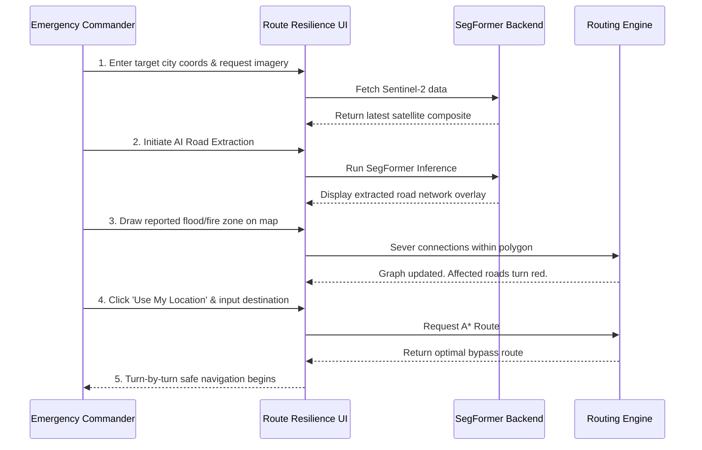

# Pitch Presentation: Route Resilience AI

This document contains tailored presentation content to help you pitch the **Route Resilience** project. 

---

## 1. How different is it from any of the other existing ideas?

*(The Differentiation / Competitive Advantage)*

Most existing navigation systems (like Google Maps, Waze, or standard OpenStreetMap) are built for everyday traffic and rely heavily on either historical data or crowdsourced mobile GPS pings. During a natural disaster (floods, landslides, wildfires), these systems critically fail because they assume roads still exist unless reported otherwise. 

**Our project is fundamentally different because it relies on real-time Earth Observation rather than historical assumptions:**

*   **Dynamic Post-Disaster Ground Truth:** Instead of waiting for manual community updates, our system actively pulls recent satellite imagery (via Google Earth Engine) to see the *actual* state of the infrastructure right now.
*   **Occlusion-Robust AI (SegFormer):** Traditional computer vision models struggle when roads are partially hidden by tree canopies, smoke, or cloud shadows. Our system uses a specialized, state-of-the-art vision transformer (SegFormer-B2) trained specifically to infer and connect broken road segments, succeeding where standard edge-detection algorithms fail.
*   **Resilience-First Modeling:** Existing routing APIs optimize for "fastest time." Our system optimizes for "highest resilience." It mathematically analyzes the road graph for chokepoints (betweenness centrality) to prevent emergency vehicles from getting trapped in fragile network bottlenecks.

## 2. How will it be able to solve the problem?

*(The Solution and Impact)*

**The Problem:** During crises, first responders waste the "golden hour" navigating blindly into flooded, blocked, or destroyed areas because their maps are outdated.
**The Solution:** Route Resilience acts as a real-time tactical overview and routing engine for emergency operations.

*   **Instant Infrastructure Mapping:** Within minutes of a disaster, the system ingests new satellite data, runs it through the AI inference pipeline, and generates a brand new, highly accurate map of the surviving road network.
*   **Mathematical Graph Updating:** When a disaster zone (e.g., a flood polygon) is identified, the system doesn't just put a visual warning on a map. It instantly severs those connections in its underlying mathematical graph (NetworkX), making it impossible for the system to route vehicles through the danger zone.
*   **Emergency A* Routing:** Using live GPS tracking, the system calculates the most robust, guaranteed path for emergency vehicles to reach victims, bypassing destroyed sectors and avoiding critical infrastructure bottlenecks.

## 3. Unique Selling Proposition (USP)

*(The One-Sentence Hook)*

**"An end-to-end, AI-powered tactical routing system that instantly converts raw satellite imagery into navigable emergency routes, even when roads are hidden by clouds or debris."**

### Key USP Pillars for your slides:
1.  **Pixel-to-Path Autonomy:** The only system that handles the entire pipeline locally—from downloading satellite pixels, to AI road extraction, to building routable graphs, to turn-by-turn navigation.
2.  **Occlusion-Resilient Computer Vision:** AI that "sees through" partial obstructions (smoke/trees) to guarantee continuous road network generation.
3.  **Dynamic Disaster Simulation:** The ability to inject real-time disaster polygons into the map and instantly recalculate the safety and centrality of the entire city's infrastructure.

---

## 4. List of Features Offered by the Solution

Here is a comprehensive feature list to highlight the technical depth of your project:

1.  **Satellite Image Ingestion Engine:** Automates the downloading and compositing of Sentinel-2 satellite imagery via Google Earth Engine based on a target city coordinate and radius.
2.  **AI-Powered Road Extraction:** Utilizes a custom-trained SegFormer-B2 neural network to detect roads in imagery, highly robust against cloud shadows and tree canopy occlusions.
3.  **Routable Network Graphing:** Automatically converts raw AI pixel masks into a mathematical Node/Edge vector graph (using NetworkX) that understands road connectivity, lengths, and intersections.
4.  **Disaster Simulation & Dynamic Weighting:** Allows command centers to draw disaster zones (floods, fires, landslides) on the live map. The system instantly updates the underlying mathematical graph to block impassable routes.
5.  **Critical Infrastructure Analysis:** Visually highlights the most critical "choke point" roads based on Betweenness Centrality mathematics, showing commanders which roads must be protected to prevent total network collapse.
6.  **Live GPS Integration:** Tracks the emergency vehicle's live location on the dashboard to provide real-time starting coordinates for dynamic routing.
7.  **Resilient Routing Engine:** Calculates the safest, most efficient path around disaster zones using advanced algorithms like A* Search, Dijkstra's, and Yen's K-Shortest Paths.

---

## 5. System Diagrams & Workflows

Here are diagrams you can screenshot or recreate for your presentation.

### A. End-to-End Architecture Diagram
This diagram shows the technical flow of data from the satellite to the user's dashboard.

```mermaid
graph TD
    subgraph "1. Earth Observation Layer"
        GEE[Google Earth Engine API]
        S2[(Sentinel-2 Satellites)]
        S2 -.->|Multispectral Imagery| GEE
    end

    subgraph "2. AI Inference Engine (FastAPI)"
        BE_Img[Image Pre-Processor]
        Model[SegFormer-B2 Vision Transformer]
        Post[Mask Skeletonization]
        
        GEE -->|Cloud-Free Composites| BE_Img
        BE_Img --> Model
        Model -->|Pixel Road Masks| Post
    end

    subgraph "3. Graph & Routing Engine"
        NX[(NetworkX Math Graph)]
        Centrality[Chokepoint Analyzer]
        AStar[A* Emergency Router]
        
        Post -->|Vector Data| NX
        NX <--> Centrality
        NX <--> AStar
    end

    subgraph "4. Command Center UI (React/Vite)"
        Map[MapLibre Interactive Map]
        GPS[Live GPS Tracker]
        Disaster[Disaster Sim Input]
        
        Disaster -.->|Injects Blocks| NX
        Map <-->|Requests Routes| AStar
        GPS --> Map
    end

    classDef tech fill:#1f2937,stroke:#3b82f6,stroke-width:2px,color:white;
    class GEE,Model,NX,Map tech;
```

### B. Use-Case Flow Diagram
This flowchart outlines the exact operational steps a first responder or commander takes when using the system during an emergency.

---

## 6. AI Image Generation Prompts

If you want to generate sleek, futuristic images for your title slide or presentation backgrounds using tools like Midjourney or DALL-E, try these prompts:

*   **Prompt 1 (Command Center):** *"A high-tech, futuristic emergency command center dashboard showing a satellite map of a city during a flood. Glowing red areas highlight the disaster zones. A glowing green artificial intelligence path is calculating a safe route around the hazards for an ambulance. Sleek dark mode UI, glowing neon accents, highly detailed, photorealistic, cinematic lighting."*
*   **Prompt 2 (AI Vision Concept):** *"A split-screen digital art piece. The left side shows a cloudy, smoke-filled satellite view of a ruined city. The right side shows a glowing, futuristic neural network analyzing the image, revealing bright glowing blue pathways representing the surviving road infrastructure beneath the smoke. Cyberpunk aesthetic, 8k resolution, Unreal Engine 5 render style."*
*   **Prompt 3 (The Vehicle):** *"An emergency response vehicle driving through a post-disaster landscape at night. A futuristic holographic map is projected on the windshield, showing a glowing green route that navigates around debris. Cinematic, dramatic lighting, high contrast."*
